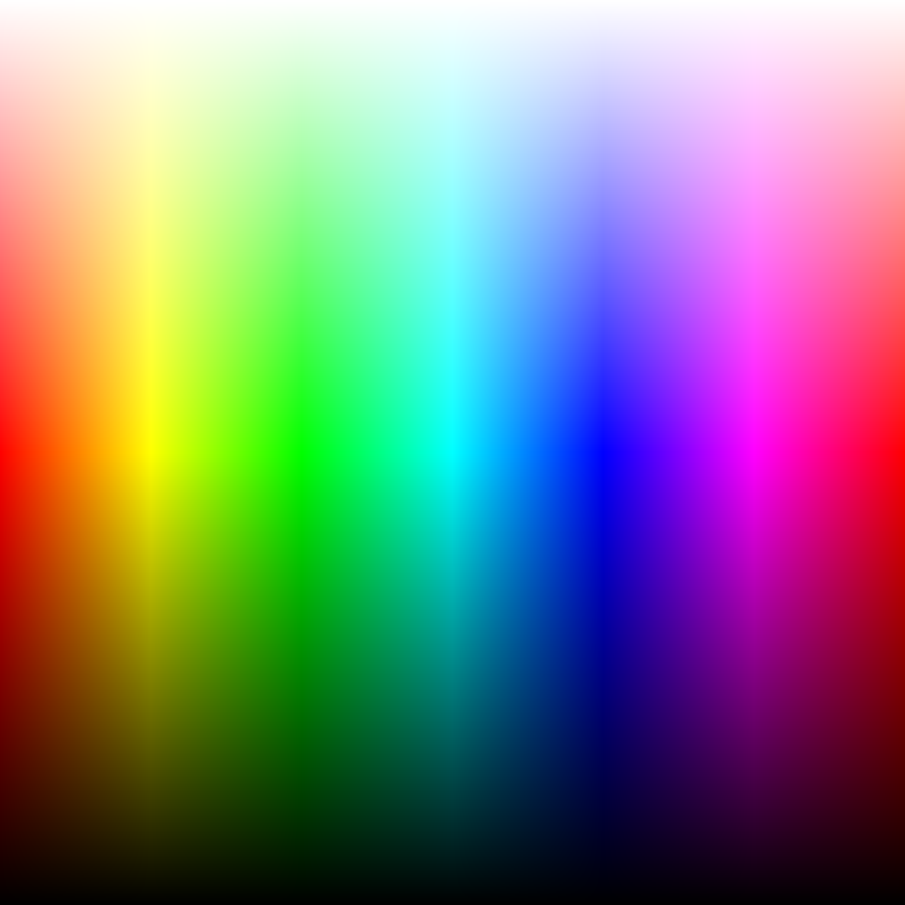

# [full_spectrum:](./full_spectrum.js)
Generate full spectrum of all possible colors into one [picture](./full_spectrum.png) 4096 x 4096 = 16,777,216.

# [jaylydev Events get:](./jaylydev_Events_get.js)
Get list of Minecraft Bedrock Script API event for my [Discrod Server](https://discord.gg/6z8ZPUdVTT) Bot.

# [jaylydev messing example:](./jaylydev_messing_example.js)
Check for messing code examples in a given class from jaylydev Minecraft Bedrock Script API docs.
(he asked for feedback about messing code examples, so i made script for it)
